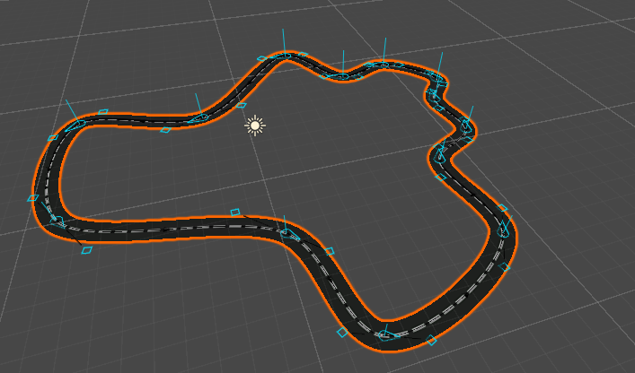
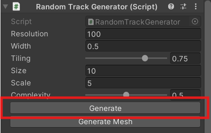
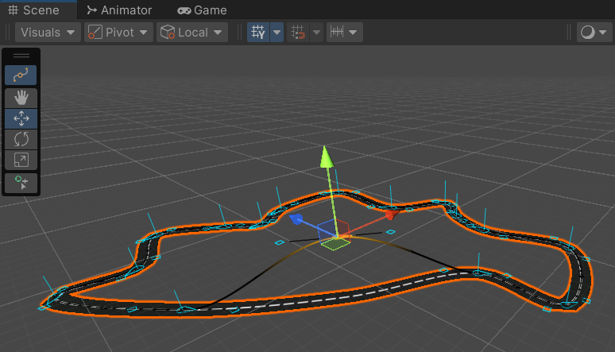
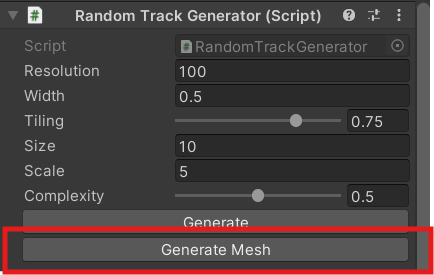
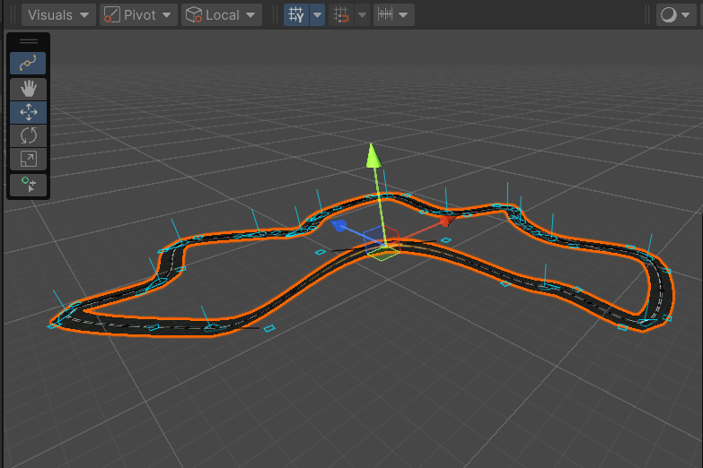

# Track Generator
[](https://github.com/rob1997/TrackGenerator/releases)
[](https://unity3d.com)
[](https://opensource.org/licenses/MIT)

A package that Procedurally Generates Closed Tracks from Voronoi Diagrams using C# Jobs System, Splines and Procedural Mesh Generation.

This package also contains a Voronoi Diagram implementation that can be found [here](https://github.com/rob1997/TrackGenerator/tree/main/Runtime/Scripts/Voronoi#voronoi).

Unity Version: `2022.3.44f1`



## Performance

| Track Size/Cells | Performance in ms |
|------------------|-------------------|
| 10               | 2.5 - 3           |
| 25               | 8 - 8.7           |
| 50               | 21 - 23           |

Complexity = 1
Smoothness = 500

## Installation
You can install the package via UPM (Unity Package Manager)
- Open the Unity Package Manager from `Window > Package Manager` and [Import Package from Git URL](https://docs.unity3d.com/Manual/upm-ui-giturl.html).
- Input the following URL: https://github.com/rob1997/TrackGenerator.git

## Configuration

Below are properties of Track Generator that you can configure to generate different types of tracks.

| **Name**   | **Type**               | **Description**                                                                                                                                  |
|------------|------------------------|--------------------------------------------------------------------------------------------------------------------------------------------------|
| Resolution | `int`                  | Number of triangles that'll be used for mesh generation, the higher the value the smoother the generated mesh.                                   |
| Width      | `float`                | Width of the generated mesh.                                                                                                                     |
| Tiling     | `Range[0f, 1f] float`  | The tiling of the generated mesh relative to the distance of the generated Spline. A value of 1 will tile the texture once per unit of distance. |
| Scale      | `float`                | Scale of the generated track.                                                                                                                    |
| Complexity | `Rangle[0f, 1f] float` | The lower the complexity the fewer sides/segments the track will have.                                                                           |

There are two types of Track Generators available in the package:

### 1. Random Track Generator

Generates a random track based on size (area).

| **Name** | **Type**               | **Description**                                                                                     |
|----------|------------------------|-----------------------------------------------------------------------------------------------------|
| Size     | `int`                  | Number of voronoi cells used to generate a random track. The higher the value the bigger the track. |

### 2. Rect Track Generator

Generates a rectangular track based on size (width, height).

| **Name** | **Type**     | **Description**                                                                              |
|----------|--------------|----------------------------------------------------------------------------------------------|
| Size     | `Vector2Int` | Determines the dimensions of the track, corresponding to width (Size.x) and height (Size.Y). |

## Setup

- Attach the `RandomTrackGenerator` or `RectTrackGenerator` `MonoBehaviour` to a `GameObject` in the Scene.  This will automatically add `SplineContainer`, `MeshRenderer` and `MeshFilter` components to the `GameObject`.


- Assign a Material of your choice to the `MeshRenderer` component. You can find a default road material in the Materials folder in the package.

## Usage

First declare a serialized implementation of `TrackGenerator`

```csharp
    [field: SerializeField] public RandomTrackGenerator TrackGenerator { get; private set; }
```

or

```csharp
    [field: SerializeField] public RectTrackGenerator TrackGenerator { get; private set; }
```

then generate track

```csharp
    private void Update()
    {
        // Generate a Random Track on Space Key Press
        if (Input.GetKeyDown(KeyCode.Space))
        {
            TrackGenerator.Generate();
        }
    }
```
The `TrackGenerator.Generate()` method generates a random track based on the `transform` of the `GameObject`.

You can also alternatively use the Generate Button in the Inspector.



You can use the Spline Editor tool to edit any generated Track Spline in the Scene View. Once you're done editing the Spline you can press the `Generate Mesh` button to generate a new mesh based on the edited Spline.







You can get the generated Vertices and Spline via `TrackGenerator.Spline` and `TrackGenerator.Vertices`.

## Contributing

If you'd like to contribute to the project, you can fork the repository and create a pull request. You can also create an issue if you find any bugs or have any feature requests.

---

##### **⚠️Caution⚠️**

As you go higher up in track size significantly you'll start to get a specific exception `Next segment not unique` more and more frequently which happens due to floating point precision. In cases where you need a significantly large track perhaps consider increasing scale instead. More on this [here](Runtime/Scripts/Voronoi/README.md#caution).

---